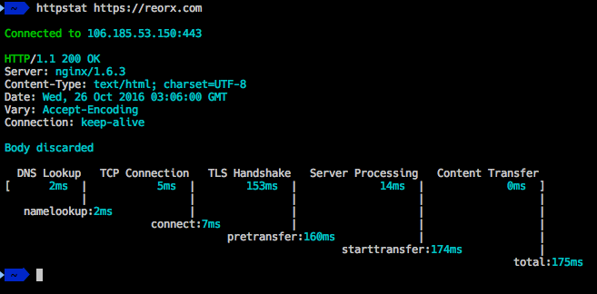

# tl;dr

A prometheus python exporter for https://github.com/yanc0/beeping

```
make build
make run
```

The resulting container will be running both, a beeping binary and the python script prometheus exporter.

Metrics available at

```
curl localhost:9118/metrics
```


  


# beeping_exporter

The [beeping service](https://github.com/yanc0/beeping) is a great tool for monitoring web sites. 

Adding a prometheus exporter allows for integration into a monitoring stack where alerts can be defined and historical data can be accessible.

# container image

The [phusion baseimage](https://hub.docker.com/r/phusion/baseimage/) image provides an easy way to declare and manage running services inside the container. For simplicity purposes, both services: beeping and the exporter run alongside on the same container.


# configuration

Configuration is setup via environment variables declared in the `beeping_exporter.env` file.


## Environment variables

```
BEEPING_INSTANCE=beeping.local
BEEPING_METRICS_PORT=9118
BEEPING_SERVER=http://localhost:8080
BEEPING_CHECKS={"example.net": {"pattern": "Example Domain", "timeout": 10, "url": "http://example.net"}, "example.org": {"pattern": "used for illustrative examples", "timeout": 10, "url": "https://www.example.org"}, "github.com": {"pattern": "Contact GitHub", "timeout": 10, "url": "https://github.com"}}
```

A helper script is provided for maintaining configuration in a yaml file: `files/beeping.yaml`.

```
CONFIG_JSON=$(files/yaml2json.py < files/beeping.yaml)
cp files/beeping_exporter.env.tpl beeping_exporter.env
echo "BEEPING_CHECKS=$CONFIG_JSON" >> beeping_exporter.env
```

# TODO

* Add graphite exporting using prometheus library support.
* Use docker multi-stage build to compile latest beeping binary and add it to the image.

# Kudos

Big kudos to Yann Coleu for [BeePing](https://github.com/yanc0/beeping).

# License

```
The MIT License (MIT)

Copyright (c) 2017 Osvaldo Toja

Permission is hereby granted, free of charge, to any person obtaining a copy
of this software and associated documentation files (the "Software"), to deal
in the Software without restriction, including without limitation the rights
to use, copy, modify, merge, publish, distribute, sublicense, and/or sell
copies of the Software, and to permit persons to whom the Software is
furnished to do so, subject to the following conditions:

The above copyright notice and this permission notice shall be included in all
copies or substantial portions of the Software.

THE SOFTWARE IS PROVIDED "AS IS", WITHOUT WARRANTY OF ANY KIND, EXPRESS OR
IMPLIED, INCLUDING BUT NOT LIMITED TO THE WARRANTIES OF MERCHANTABILITY,
FITNESS FOR A PARTICULAR PURPOSE AND NONINFRINGEMENT. IN NO EVENT SHALL THE
AUTHORS OR COPYRIGHT HOLDERS BE LIABLE FOR ANY CLAIM, DAMAGES OR OTHER
LIABILITY, WHETHER IN AN ACTION OF CONTRACT, TORT OR OTHERWISE, ARISING FROM,
OUT OF OR IN CONNECTION WITH THE SOFTWARE OR THE USE OR OTHER DEALINGS IN THE
SOFTWARE.
```